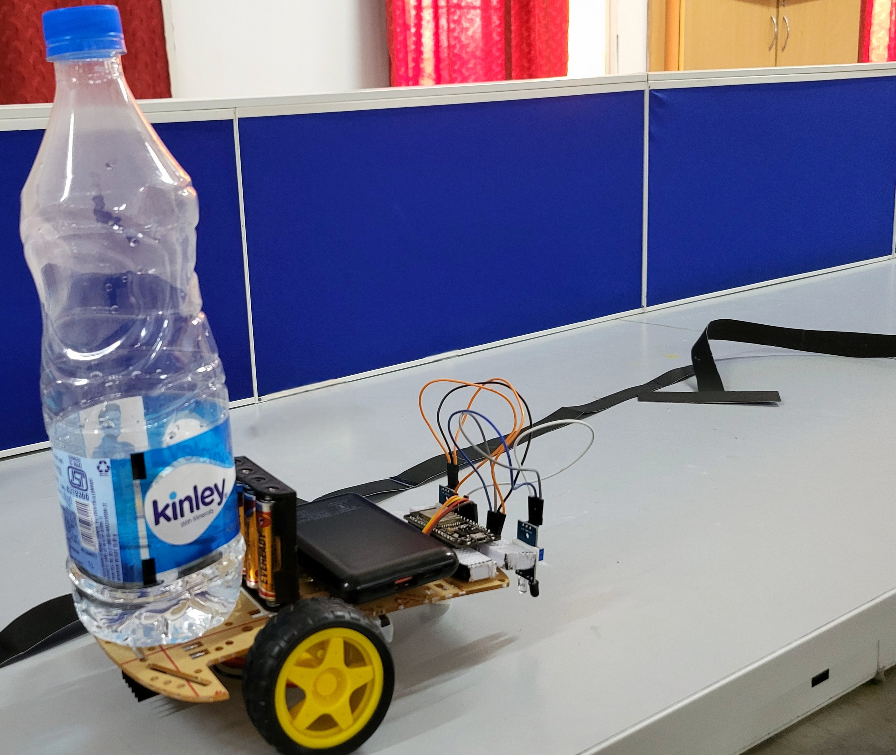

# Tin Reloader
<h2>Team Details</h2>
<b>Team Number: </b>
24AACR26

<b>Senior Mentor:</b>
Kranthi

<b>Junior Mentor:</b>
B Abhiram

<b>Team Member 1:</b>
Aasrith Manikanta Kavali

<b>Team Member 2:</b>
Rohith Paruchuri

<b>Team Member 3:</b>
Pranava Juvvadi

<b>Team Member 4:</b>
Vasa Duniya

  

<h2> Abstract </h2>

The TinReloader project addresses the challenge of managing water dispenser refills efficiently. It consists of two main parts: first, dispenser, it detects when a water dispenser tin is empty using an ultrasonic sensor and also dispenses water without contact. Second, it employs a robotic rover with a line-following mechanism to deliver a new water tin to the pre designated rooms. Once the tin is picked up by the user, the rover returns to the filling station. This project combines automation and robotics to streamline water refilling, making it a convenient and innovative solution for daily use.

## Table of Contents
- [Introduction](#introduction)  
- [Requirements](#requirements)  
- [How to use](#installation-and-usage)  
- [Preview](#previews)
- [Contribution](#contribution)

## Requirements

### Hardware
- ESP32 Boards  
- Power Supply (batteries / power bank)  
- 3 wheel kit  
- Wi-Fi Connection  
- Connecting wires and bread boards

### Software
- Arduino IDE  
- ESP32 Board Package  
- Blynk Library  
- WiFi Library  

<!-- | </a> | -->

## Installation and usage
Step by step process of cloning the project, installments needed and how to use it

- Clone the repository with `git clone https://github.com/AAC-Open-Source-Pool/Automated-Water-Delivery-System.git`
- Wire the components as shown in the circuit diagram to establish the necessary connections as per (circuit diagram)[]. (Change Arduino with ESP 32)
- Install all dependencies
- Setup [BLYNK](https://blynk.cloud/dashboard/login) as per the virtual pins given in the code
- Copy the `Auth Token` from the Devices pannel and paste in the code
- Go to `Devices/<device name>/Edit Dashboard/Firmware configuration`
- Copy the Data and put it at the top of the code
- Compile `Use arrow button at the top left` and upload the files to ESP 32

## Preview

  

 
## Contribution 
**This section provides instructions and details on how to submit a contribution via a pull request. It is important to follow these guidelines to make sure your pull request is accepted.**
1. Before choosing to propose changes to this project, it is advisable to go through the readme.md file of the project to get the philosophy and the motive that went behind this project. The pull request should align with the philosophy and the motive of the original poster of this project.
2. To add your chan ges, make sure that the programming language in which you are proposing the changes should be the same as the programming language that has been used in the project. The versions of the programming language and the libraries(if any) used should also match with the original code.
3. Write a documentation on the changes that you are proposing. The documentation should include the problems you have noticed in the code(if any), the changes you would like to propose, the reason for these changes, and sample test cases. Remember that the topics in the documentation are strictly not limited to the topics aforementioned, but are just an inclusion.
4. Submit a pull request via [Git etiquettes](https://gist.github.com/mikepea/863f63d6e37281e329f8) 

